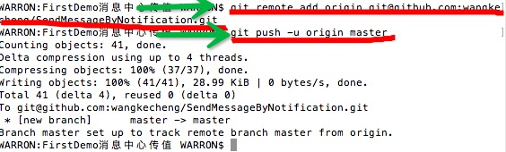

上传项目到Git

服务器端： 
1.


2.

这样即可创建一个服务器端的代码托管


MAC端
 1.创建一个本地的.ssh文件
  - 由于本地Git仓库和GitHub仓库之间的传输是通过SSH加密的，所以要在本地生成一个私钥和一个密钥，直接打开LaunchPad -> 其他 ->终端 输入
defaults write com.apple.finder AppleShowAllFiles -bool true  //  终端 显示隐藏文件（需要重新运行Finder)。
  -  点击桌面顶部菜单 前往>个人 看看自己电脑上有没有个 .ssh 的隐藏文件，有的话个人建议删除，新建个。
  -  mkdir .ssh    //终端新建个 .ssh文件
  -  cd .ssh  // 进入到刚才新建的.ssh文件目录下
  -  ssh-Keygen -t rsa -C "your_email@example.com"       //后面“ ”里面 随意输入个邮箱就行,回车会提示你输入密码什么的，可以无视一直回车下去。
  -  ls -la     // 查看是否存在 id_rsa(私钥)  id_rsa.pub(公钥) 这两个东西，如果存在就成功了
  -  pbcopy < ~/.ssh/id_rsa.pub     //拷贝公钥
  -  进入

  - 然后创建


  - ssh -T git@github.com 新添加到github上的秘钥左边的点一开始是灰色的，终端执行这个命令后，刷新网页会看到灰色点变成了绿色。
  

  - ssh -T git@github.com 如果出现如下提示，表示你连已经连上了.(因为有了第一步，所以不用自己做过多的连接github的操作了，另外，下一次要连接github的时候记得打开第一步的工具).
   - Hi MiracleHe! You've successfully authenticated, but GitHub does not provide shell access.

  - 这个就是服务器端和本地建立了安全连接，设置一次之后就可以了，以后上传项目都不用再设置这个安全连接了（还有一种设置单个项目的安全连接，最后讲解）
   
2
 - 在终端中进入自己创建的项目 我创建的项目是这个（拖住文件夹往终端中放置即可得到文件夹路径）



 - 显示Compressing objects: 100% (37/37), done. 即表示上传成功
 
 - 各个代码含义
    - git add README.md //添加（若在FirstDemo消息中心传值中还要添加文件，这个文件要传到git上则必须用这段代码，上图箭头指错方向了）
    - git add *  //加入所有项目
    - git status //检查状态 如果都是绿的 证明成功
    - git commit -m "first commit"//提交到要地仓库，并写一些注释
    - git remote add origin git@github.com:warron/SendMessageByNotification //连接远程仓库并建了一个名叫：origin的别名
    - git push -u origin master //将本地仓库的东西提交到地址是origin的地址，master分支下
 - 有些代码在服务器端创建托管后，可以在这里拷贝


#若继续上传第二个项目 则只需做一下步骤即可上传
 - 服务器端创建一个项目
 
 - mac端 
   -  进入项目目录
   -  git init 
   -  git add *  
   -  git status 
   -  git commit -m "first commit"//提交到要地仓库，并写一些注释
   -  git remote add origin   
   -  git@github.com:warron/Test.git //com:后面的warron为分支名 / 后面为项目名，我这里的分支名为warron，项目名为test.git
git push -u origin master

```
remote origin already exists.
1、先输入$ git remote rm origin
2.再输入git@github.com:warron/Test.git //com:

```
#另外，给每个项目创建一个安全连接，
 - 你可以按如下命令来生成sshkey：
 你可以按如下命令来生成sshkey：
     
     ``` shell
     $ ssh-keygen -t rsa -C "xxxxx@xxxxx.com"
     ```
     
     其中`xxxxx@xxxxx.com`需要填写邮箱信息
     
     生成SSH key时，如果不清楚需要输入的信息，可以全部输入Enter键。
     
  2. ##### 查看你的public key，并把他添加到Git托管平台
     
     ``` shell
     $ cat ~/.ssh/id_rsa.pub
     ``` 
     同样用
      ``` shell
     pbcopy < ~/.ssh/id_rsa.pub     //拷贝公钥，再添加到服务器端，此处添加步骤和之前相同
         ``` 
  3. ##### 测试是否添加成功
     
     测试Git@OSC输入命令：
     
     ``` shell
     $ ssh -T git@git.oschina.net
     Welcome to Git@OSC, yourname! 
     ```
     
     测试Github输入命令：
     
     ``` shell
     $ ssh -T git@github.com
     Hi chaoskyme! Youve successfully authenticated, but GitHub does not provide shell access.
     ```
  
  生成SSH key只需要生成一次，不同的网站再将公钥拷贝到网站上即可。
  
   参考链接:http://www.jianshu.com/p/e7501b968256


#github常见操作和常见错误！错误提示：fatal: remote origin already exists.  
如果输入$ git remote add origin git@github.com:djqiang（github帐号名）/gitdemo（项目名）.git 
    提示出错信息：fatal: remote origin already exists.
    解决办法如下：
    1、先输入$ git remote rm origin
    2、再输入$ git remote add origin git@github.com:djqiang/gitdemo.git 就不会报错了！
    3、如果输入$ git remote rm origin 还是报错的话，error: Could not remove config section 'remote.origin'. 我们需要修改gitconfig文件的内容
    4、找到你的github的安装路径，我的是C:\Users\ASUS\AppData\Local\GitHub\PortableGit_ca477551eeb4aea0e4ae9fcd3358bd96720bb5c8\etc
    5、找到一个名为gitconfig的文件，打开它把里面的[remote "origin"]那一行删掉就好了！
 
 
    如果输入$ ssh -T git@github.com
    出现错误提示：Permission denied (publickey).因为新生成的key不能加入ssh就会导致连接不上github。
    解决办法如下：
    1、先输入$ ssh-agent，再输入$ ssh-add ~/.ssh/id_key，这样就可以了。
    2、如果还是不行的话，输入ssh-add ~/.ssh/id_key 命令后出现报错Could not open a connection to your authentication agent.解决方法是key用Git Gui的ssh工具生成，这样生成的时候key就直接保存在ssh中了，不需要再ssh-add命令加入了，其它的user，token等配置都用命令行来做。
    3、最好检查一下在你复制id_rsa.pub文件的内容时有没有产生多余的空格或空行，有些编辑器会帮你添加这些的。
 
 
    如果输入$ git push origin master
    提示出错信息：error:failed to push som refs to .......
    解决办法如下：
    1、先输入$ git pull origin master //先把远程服务器github上面的文件拉下来
    2、再输入$ git push origin master
    3、如果出现报错 fatal: Couldn't find remote ref master或者fatal: 'origin' does not appear to be a git repository以及fatal: Could not read from remote repository.
    4、则需要重新输入$ git remote add origingit@github.com:djqiang/gitdemo.git
 
 
    使用git在本地创建一个项目的过程
    $ makdir ~/hello-world    //创建一个项目hello-world
    $ cd ~/hello-world       //打开这个项目
    $ git init             //初始化 
    $ touch README
    $ git add README        //更新README文件
    $ git commit -m 'first commit'     //提交更新，并注释信息“first commit”
    $ git remote add origin git@github.com:defnngj/hello-world.git     //连接远程github项目  
    $ git push -u origin master     //将本地项目更新到github项目上去
 
   
    gitconfig配置文件
         Git有一个工具被称为git config，它允许你获得和设置配置变量；这些变量可以控制Git的外观和操作的各个方面。这些变量可以被存储在三个不同的位置： 
         1./etc/gitconfig 文件：包含了适用于系统所有用户和所有库的值。如果你传递参数选项’--system’ 给 git config，它将明确的读和写这个文件。 
         2.~/.gitconfig 文件 ：具体到你的用户。你可以通过传递--global 选项使Git 读或写这个特定的文件。
         3.位于git目录的config文件 (也就是 .git/config) ：无论你当前在用的库是什么，特定指向该单一的库。每个级别重写前一个级别的值。因此，在.git/config中的值覆盖了在/etc/gitconfig中的同一个值。
        在Windows系统中，Git在$HOME目录中查找.gitconfig文件（对大多数人来说，位于C:\Documents and Settings\$USER下）。它也会查找/etc/gitconfig，尽管它是相对于Msys 根目录的。这可能是你在Windows中运行安装程序时决定安装Git的任何地方。
 
        配置相关信息：
        2.1　当你安装Git后首先要做的事情是设置你的用户名称和e-mail地址。这是非常重要的，因为每次Git提交都会使用该信息。它被永远的嵌入到了你的提交中：
　　$ git config --global user.name "John Doe"
　　$ git config --global user.email johndoe@example.com
 
       2.2    你的编辑器(Your Editor)
　　现在，你的标识已经设置，你可以配置你的缺省文本编辑器，Git在需要你输入一些消息时会使用该文本编辑器。缺省情况下，Git使用你的系统的缺省编辑器，这通常可能是vi 或者 vim。如果你想使用一个不同的文本编辑器，例如Emacs，你可以做如下操作：
　　$ git config --global core.editor emacs
 
      2.3 检查你的设置(Checking Your Settings)
　　如果你想检查你的设置，你可以使用 git config --list 命令来列出Git可以在该处找到的所有的设置:
　　$ git config --list
      你也可以查看Git认为的一个特定的关键字目前的值，使用如下命令 git config {key}:
　　$ git config user.name
 
      2.4 获取帮助(Getting help)
　　如果当你在使用Git时需要帮助，有三种方法可以获得任何git命令的手册页(manpage)帮助信息:
　　$ git help <verb>
　　$ git <verb> --help
　　$ man git-<verb>
　　例如，你可以运行如下命令获取对config命令的手册页帮助:
　　$ git help config


